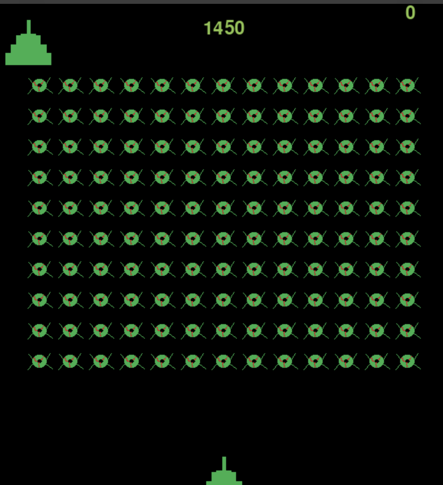

# Galaxy-striker 🚀🎮

Welcome to an immersive gaming experience! Our project invites you to explore a rich world filled with excitement, challenges, and endless possibilities. Get ready to dive into thrilling adventures, forge new paths, and unleash your gaming prowess. Join us on this epic journey where creativity meets innovation, and every moment promises excitement. Your adventure begins here!
This is a simple Space Invaders-like game built in Python using Pygame.

## Overview 🌌

The game consists of a player-controlled spaceship that shoots bullets to eliminate incoming alien invaders. The objective is to survive as long as possible while scoring points for each alien defeated.

## Files 📁

- `bullet.py`: Contains the Bullet class handling bullet mechanics.
- `controls.py`: Manages user input events and game updates.
- `gun.py`: Defines the Gun class representing the player's spaceship.
- `highscore.txt`: Stores the highest achieved score in the game.
- `ino.py`: Implements the Ino class representing the alien invaders.
- `scores.py`: Handles the game's scoring system and display.
- `space_game.py`: Main game file orchestrating game initialization and loop.
- `stats.py`: Manages game statistics like remaining lives and current score.

## How to Run ▶️

1. Ensure you have Python installed (preferably Python 3).
2. Install Pygame by running `pip install pygame` in your terminal or command prompt.
3. Run `space_game.py` using Python (`python space_game.py`) to start the game.

## Gameplay 🎮

- Use the **left** and **right arrow keys** to move the spaceship.
- Press the **spacebar** to shoot bullets at the incoming alien invaders.
- Your score increases by defeating aliens.
- The game ends when the aliens reach the bottom or when you run out of lives.

## Screenshot

## Features ✨

- Player-controlled spaceship.
- Alien invaders movement and elimination.
- Scoring system displaying current and high scores.
- Limited lives for the player's spaceship.
